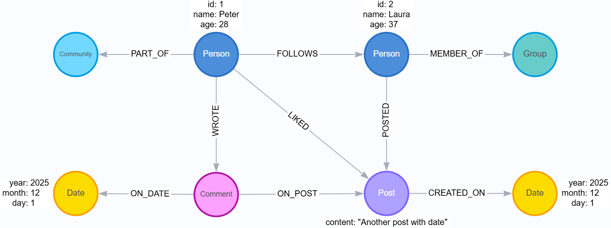

# 🌐 Social Network Graph Analysis with Neo4j

## 📌 Overview

This project implements a Graph Database Model for a Social Network using Neo4j.
The goal is to provide insights into user engagement, content popularity, and social connections such as friendships, communities, and interactions with posts.

The system uses Cypher queries to answer complex questions about user behavior, shortest paths, recommendations, and community discovery.

## 🧩 Problem Statement

A social media analytics startup wants to develop a product capable of understanding engagement patterns and connections between users across the platform.

They need a functional prototype that can answer complex questions such as:

- How users interact with content
- Which posts receive the most attention
- How users are connected to one another
- What communities are formed inside the platform

This prototype must use graph-based modeling to make these insights efficient and intuitive.

## 🎯 Challenge

Using graph modeling principles, you must design, build, and query a complete Neo4j database that represents a social network — including users, posts, comments, groups, and communities.

## 📐 Graph Data Model

### Node Labels

- Person
- Post
- Comment
- Data
- Group
- Community

### Relationships

- `(:Person)-[:FOLLOWS]->(:Person)`
- `(:Person)-[:POSTED]->(:Post) `
- `(:Person)-[:LIKED]->(:Post)`
- `(:Post)-[:CREATED_ON]->(:Data)` 
- `(:Person)-[:WRITE]->(:Comment)`
- `(:Comment)-[:ON_DATE]->(:Data)` 
- `(:Person)-[:MEMBER_OF]->(:Group)` 
- `(:Group)-[:PART_OF]->(:Community)`

This graph allows deep insights into relationships, influence, popularity, and connection paths.

## 🧱 Data Model Diagram

## 🔍 Useful Cypher Queries

1. Recommend user based on groups
